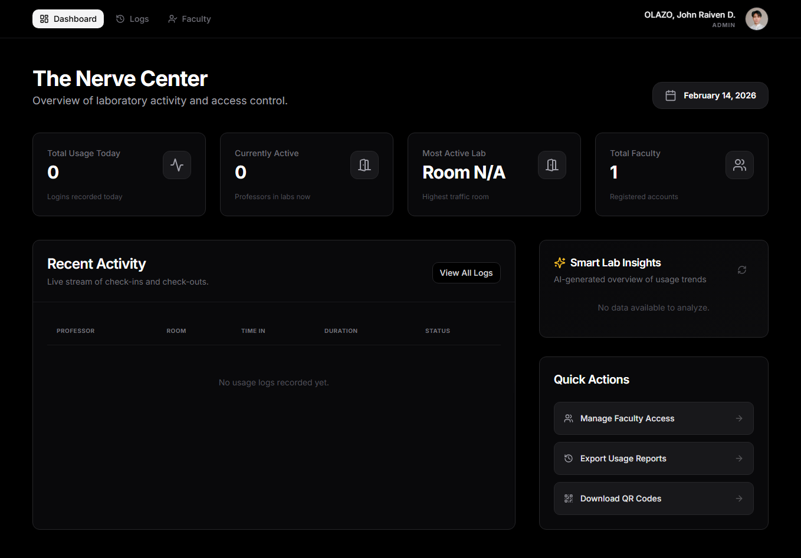
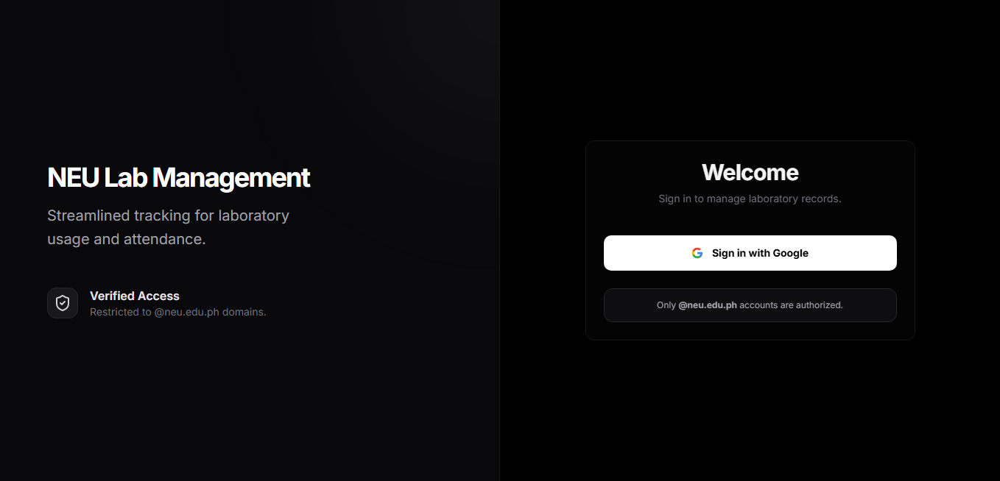
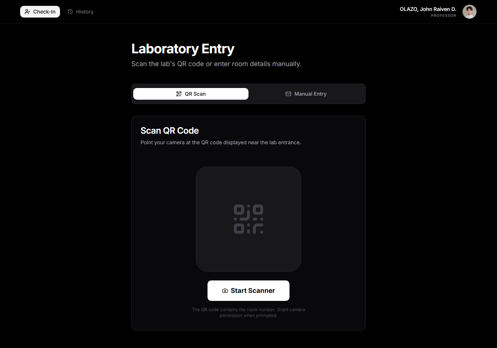
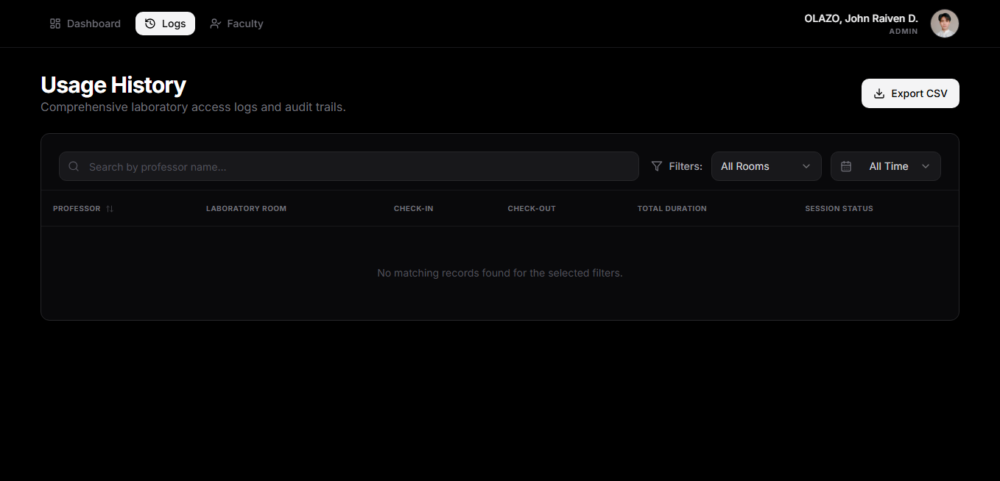
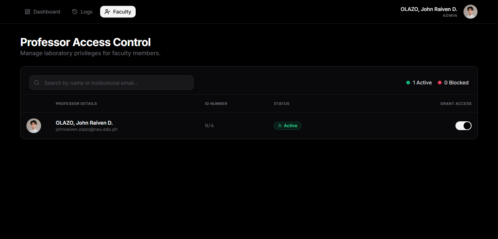

# NEU Lab Management System

A web application for tracking laboratory usage and professor attendance using QR codes.


*(Placeholder: Admin Dashboard)*

## Overview

This system replaces manual logbooks with a digital tracking solution. It allows professors to check in and out of laboratories by scanning a QR code, while administrators can monitor usage in real-time.

## Features

### Admin Panel
*   **Dashboard**: View active lab sessions and current room occupancy.
*   **User Management**: Approve or block professor accounts.
*   **Usage Logs**: Searchable history of all check-ins and check-outs.
*   **QR Generation**: Generate unique QR codes for each laboratory room.

### Professor Interface
*   **QR Check-In**: Scan a room's QR code to start a session.
*   **Session History**: View personal teaching logs.
*   **Mobile Support**: Optimized for phone browsers for easy scanning.

## Tech Stack

*   **Frontend**: Next.js 14 (App Router), TypeScript, Tailwind CSS
*   **Backend**: Firebase (Firestore, Auth, Functions)
*   **Auth**: Google Workspace (restricted to `@neu.edu.ph`)
*   **Deployment**: Vercel

## docs

| Login Page | Professor Check-In |
|:---:|:---:|
|  |  |

| Usage Logs | User Management |
|:---:|:---:|
|  |  |

## Setup & Installation

1.  **Clone the repo**
    ```bash
    git clone https://github.com/johnraivenolazo/laboratory-log-management.git
    cd laboratory-log-management
    ```

2.  **Install dependencies**
    ```bash
    pnpm install
    ```

3.  **Configure Firebase**
    *   Create a project in Firebase Console.
    *   Enable Auth (Google) and Firestore.
    *   Copy `firestore.rules` to your Firebase Security Rules.
    *   Create a `.env.local` file with your API keys.

4.  **Run locally**
    ```bash
    pnpm dev
    ```

## Admin Access

To make a user an admin, manually update their document in the `roles_admin` Firestore collection:
*   **Document ID**: User's UID
*   **Field**: `active: true`

## License
Proprietary software for New Era University.

